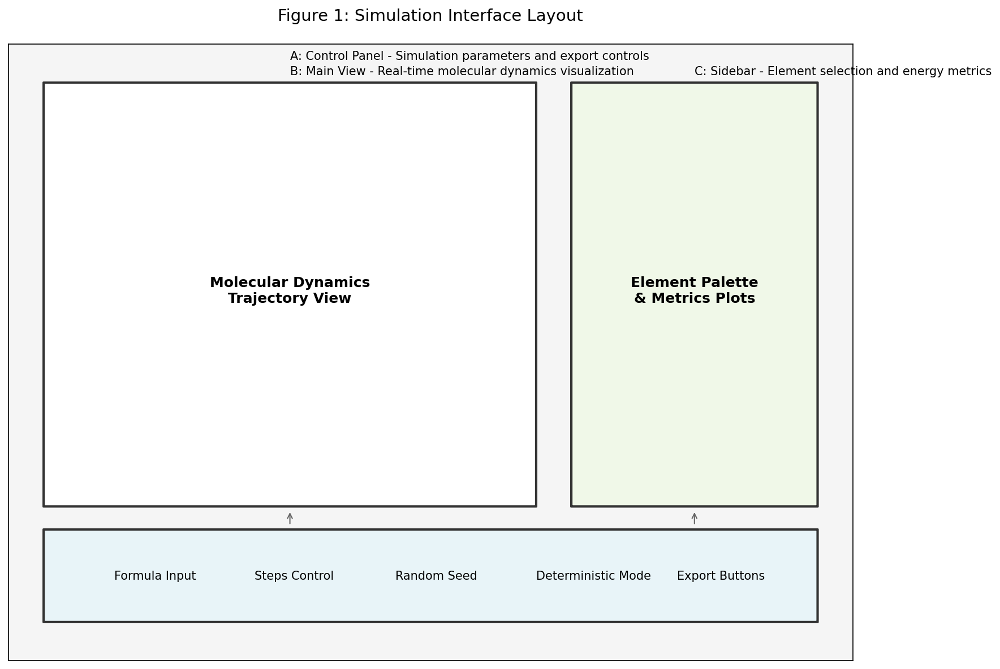
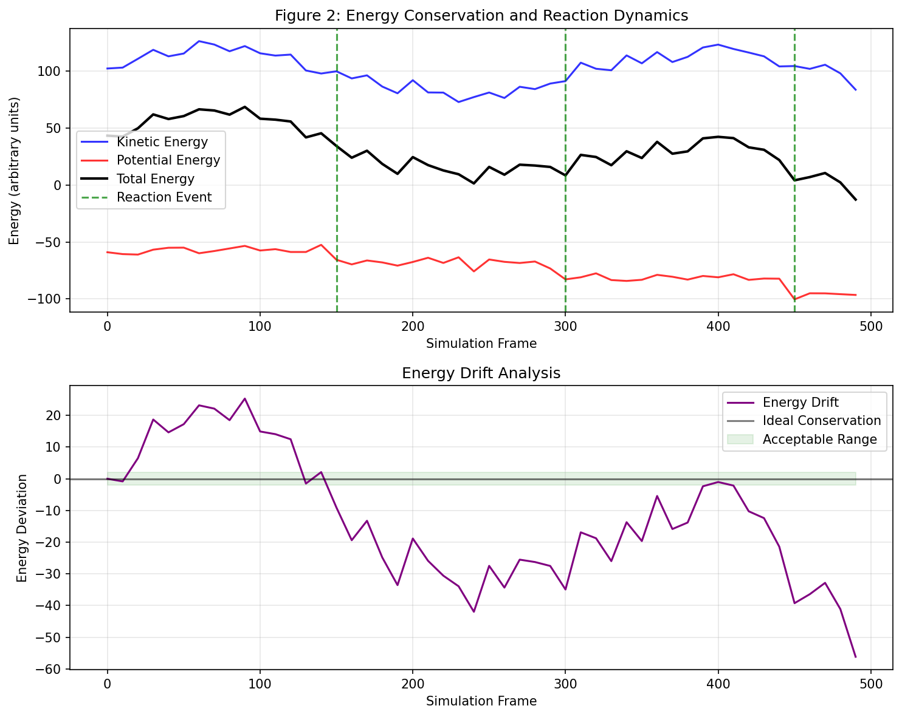
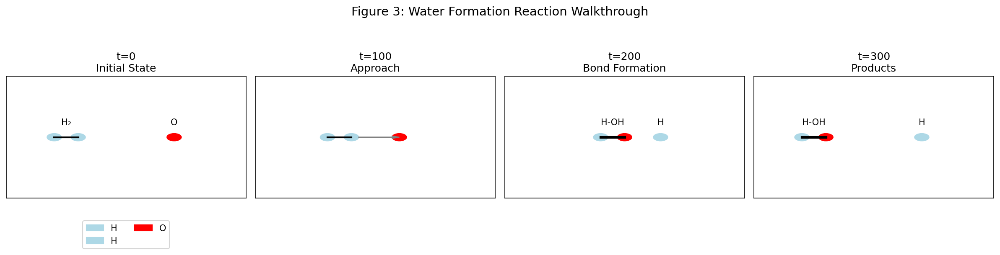

# ElementsProject: Educational Molecular Dynamics Simulator

A 2D particle-based simulation of molecular interactions and reactions, designed for educational exploration of chemical bonding, electrostatic forces, and reaction dynamics.

## System Overview

This simulator implements a hybrid computational chemistry approach combining classical molecular dynamics with heuristic bonding rules. The system models atomic interactions in a 2D space using Newtonian mechanics, with extensions for ionic chemistry and reproducible simulation runs.

### Core Components

**Physics Engine**: Implements Velocity-Verlet integration with Lennard-Jones potentials for van der Waals interactions and Coulomb's law for electrostatic forces between charged particles.

**Bonding System**: Uses distance-based heuristics and electronegativity differences to determine bond formation, with support for covalent and ionic bonding patterns.

**Reaction Engine**: Applies probabilistic rules for bond breakage and formation, enabling simulation of simple chemical reactions like water formation from hydrogen and oxygen.

**Visualization**: Real-time matplotlib-based rendering with publication-quality export capabilities for static images and interactive HTML animations.

**Reproducibility Framework**: Deterministic random number generation with seed control, comprehensive state export, and configuration management for scientific validation.

### User Interface

The graphical interface provides three-panel layout optimized for scientific workflows:

- **Control Panel**: Input fields for molecular formulas, simulation parameters, random seeds, and export controls
- **Main View**: Real-time trajectory visualization with atom positions, bonds, and charge indicators
- **Sidebar**: Interactive periodic table for element selection with oxidation states, and live energy metrics plots



### Key Features

- Interactive element selection with oxidation state control
- Real-time energy monitoring (kinetic, potential, total)
- Deterministic simulation modes for reproducible results
- Multiple export formats (JSON configuration, CSV metrics, PNG screenshots, HTML animations)
- Support for ionic chemistry with charge-based interactions

## Modeling Assumptions

### Physical Approximations

**Classical Mechanics**: All atomic motion follows Newton's laws without quantum effects. Electron tunneling, wave function collapse, and quantum tunneling are not modeled.

**Pairwise Additivity**: Interatomic forces are calculated as sums of pairwise interactions. Many-body effects in electron correlation and polarization are neglected.

**Reduced Dimensionality**: Simulations occur in 2D space for computational efficiency and visualization clarity. This simplifies collision dynamics and phase space exploration.

**Simplified Electrostatics**: Coulomb interactions use point charges without screening effects or dielectric constants. Charge distributions are approximated as point charges at atomic centers.

### Bonding Model

**Distance-Based Rules**: Bond formation depends primarily on interatomic distance and element electronegativity differences. Quantum mechanical orbital overlap is not calculated.

**Heuristic Probabilities**: Bond formation and breakage follow probabilistic rules rather than quantum mechanical transition state theory or Arrhenius kinetics.

**Empirical Parameters**: Force constants, interaction strengths, and bonding thresholds are tuned for numerical stability rather than experimental accuracy.

### Thermodynamic Control

**Langevin Thermostat**: Temperature regulation uses stochastic forces and friction terms. This ensures thermal equilibrium but sacrifices strict energy conservation.

**Reduced Units**: All physical quantities use arbitrary units rather than SI units, chosen for numerical stability and computational efficiency.

### Reaction Dynamics

**Probabilistic Events**: Chemical reactions occur through stochastic bond rearrangement rather than continuous potential energy surface traversal.

**Limited Reaction Types**: Only supports simple bond formation/breakage. Complex reaction mechanisms involving intermediates or catalysis are not implemented.

## Limitations and Future Work

### Current Limitations

**Quantitative Accuracy**: Energy values, bond strengths, and reaction rates are approximate. The system prioritizes qualitative understanding over quantitative prediction.

**Reaction Scope**: Limited to simple molecular systems. Complex reactions involving transition metals, radicals, or multi-step mechanisms are not supported.

**Numerical Stability**: Energy conservation is approximate due to thermostat intervention. Long simulations may accumulate numerical drift.

**Computational Scaling**: 2D implementation limits scalability to larger systems. Memory usage grows quadratically with atom count.

### Validation Gaps

**Experimental Comparison**: Force field parameters are not validated against experimental data. Results should not be used for predictive chemistry.

**Quantum Effects**: Ignores all quantum mechanical phenomena including zero-point energy, electron correlation, and tunneling.

**Phase Behavior**: Cannot model phase transitions, crystal structures, or solvent effects due to simplified interaction potentials.

### Future Development Opportunities

**Enhanced Force Fields**: Integration of validated force field parameters (e.g., OPLS, AMBER) for improved quantitative accuracy.

**Quantum Corrections**: Addition of quantum mechanical corrections for small systems or specific reaction types.

**3D Extension**: Migration to full 3D simulation space for more realistic molecular dynamics.

**Advanced Reaction Modeling**: Implementation of transition state theory, reaction coordinate methods, or machine learning-based reaction prediction.

**Performance Optimization**: GPU acceleration and parallel computing for larger system sizes.

**Validation Suite**: Development of benchmark tests against experimental data and comparison with established molecular dynamics packages.

## Energy Analysis Example

The simulator provides detailed energy tracking throughout simulation trajectories. Energy conservation monitoring helps validate numerical stability and identify reaction events.



The upper panel shows kinetic, potential, and total energy time series. Reaction events appear as sudden drops in potential energy (exothermic processes). The lower panel displays energy drift analysis, measuring deviation from ideal energy conservation. Acceptable drift remains within ±2% of initial total energy.

## Reaction Walkthrough: Water Formation

A typical simulation demonstrates hydrogen-oxygen reaction dynamics. Starting with separate H₂ and O molecules, the system evolves through collision, bond rearrangement, and product formation.



1. **Initial State**: H₂ and O molecules positioned separately with no interactions
2. **Approach Phase**: Thermal motion brings molecules into reactive proximity
3. **Bond Formation**: One H-O bond forms through heuristic bonding rules
4. **Products**: H-OH and free H atoms represent the reaction products

This example illustrates the simulator's capability for qualitative reaction modeling while highlighting the simplified nature of the bonding heuristics.

## Installation and Usage

### Requirements
- Python 3.8+
- NumPy, Matplotlib, Tkinter

### Installation
```bash
pip install -r requirements.txt
```

### Basic Usage
```bash
# Run GUI
python main.py

# CLI simulation with export
python cli.py --formulas H2,O --frames 600 --deterministic --seed 42 --export-html sim.html
```

### Reproducibility
For publication-quality results, always specify seeds and enable deterministic mode:
```python
from engine.simulation_manager import SimulationManager
sim = SimulationManager([{"H":2}, {"O":1}], deterministic_mode=True, seed=42)
```

## Citation

This educational simulator is designed for pedagogical use in chemistry and physics education. Results should be clearly labeled as computational approximations when used in educational materials or publications.
